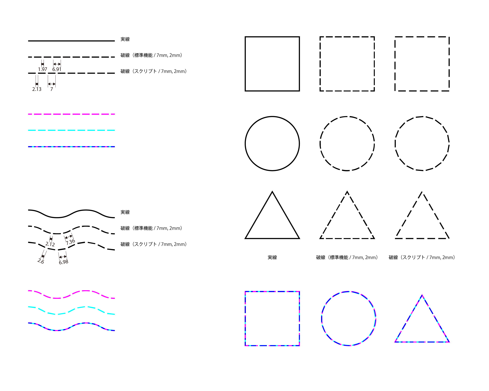

# shibori-hasen

選択したパスを有松・鳴海絞の下絵で使用される「破線」風の dash 群に変換する Adobe Illustrator 用 ExtendScript（.jsx）です。

頂点（アンカーコーナー）を基準に dash の間隔を自動調整するため、角や閉パスの折り返しで dash が連結したり消えたりせず、視覚的に整った破線が得られます。

**バージョン: 0.3.0**

---

## 動作条件

- Adobe Illustrator 30.x（macOS で動作確認）
  - ScriptUI（ExtendScript）が動く環境であれば 27.x 以降でも概ね動作する見込みですが、未検証です。
- ガイド・クリッピングパスはスキップされます

---

## インストール

1. このリポジトリの `shibori-hasen.jsx` をダウンロード
2. 任意のフォルダに配置（Illustrator の Scripts フォルダに置けばメニューから直接実行可能）

---

## 使い方

1. Illustrator で破線化したいパスを **選択**
2. `ファイル > スクリプト > その他のスクリプト...` から `shibori-hasen.jsx` を実行
3. 表示されるダイアログでパラメータを調整して **OK**
4. `shibori-hasen-dashes` という名前のグループが生成され、元のパスは非表示になります

### パラメータ

| 項目                         | 内容                                                          |
| ---------------------------- | ------------------------------------------------------------- |
| 破線長 mm                    | 1 dash の目標長さ（mm 指定）                                  |
| 間隔 mm                      | dash 同士の目標隙間（mm 指定）                                |
| minDash unit                 | 最小 dash 長さ（これ以下は描画しない）                        |
| anchor 角度                  | 入出接線の角度差がこの値以上のアンカー点を「角」として検出    |
| アンカー角を検出する         | 角検出を有効にする                                            |
| 角をまたぐ dash だけ描かない | 角でセグメントを分割し、両側の dash 間隔を独立に最適化        |
| 線端を丸くする               | round cap（既定 ON）                                          |
| 丸端補正を使う               | round cap で見た目の dash/gap がユーザ指定値と一致するよう補正 |
| 確定時に元線を非表示にする   | OK 後に元線を hidden 化（OFF にすれば残ります）               |

---

## ライセンス

MIT
